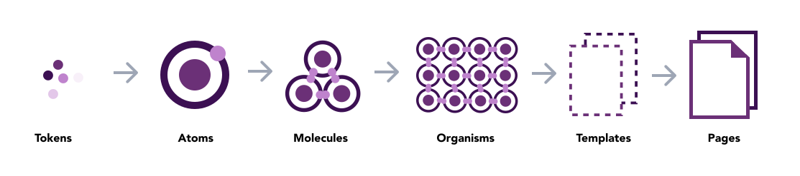
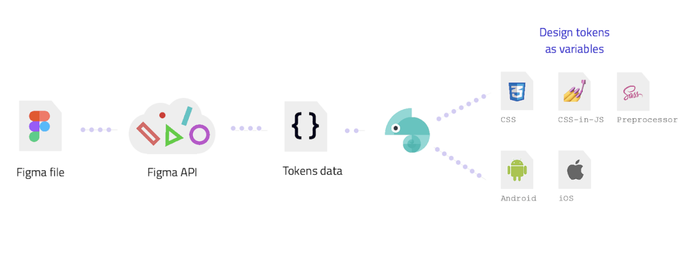

# AEMO Design Tokens
Design tokens for all platforms.


## About
Design tokens are named and stored visual design traits, including colors, typography, and animation timings. Design Tokens are the heart of every Design System.



## Approach


## Installation
```bash
npm i @danielwang/aemo-design-tokens
```
## Usage
```css
@import "@danielwang/aemo-design-tokens/dist/_tokens.css"; 
```

## Publish NPM Package
```bash
npm publish
```


## Generate tokens

```bash
npm run build
```

## Reference

This tool is using [Style Dictionary](https://amzn.github.io/style-dictionary/#/).
